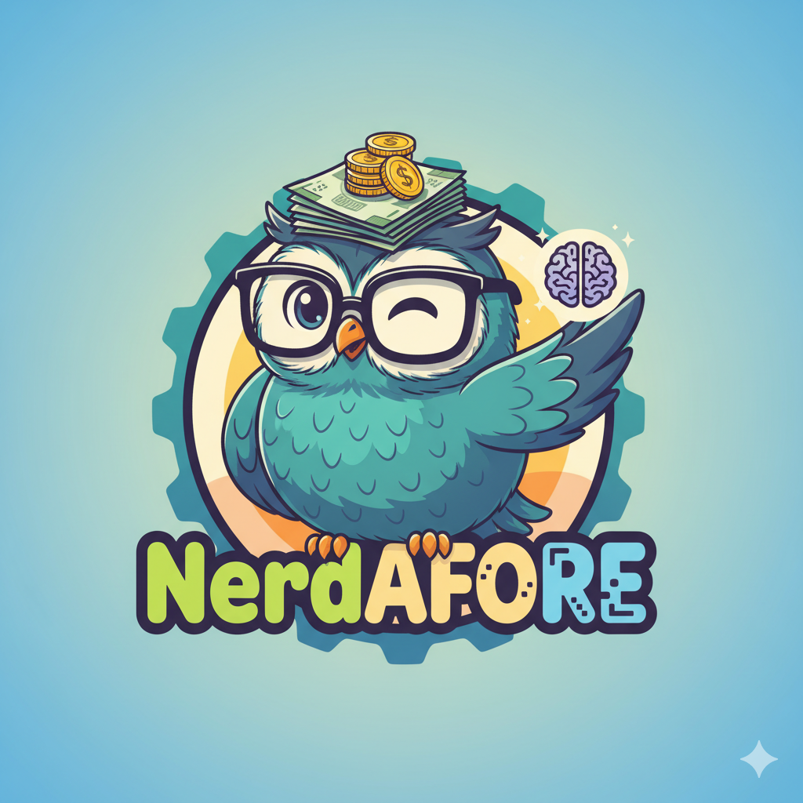
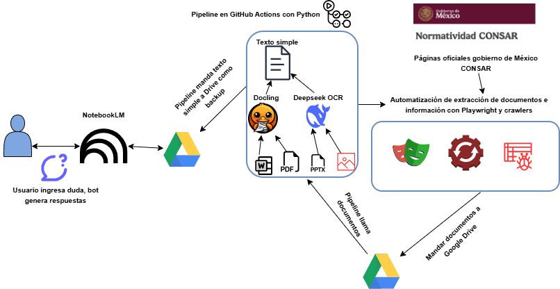

# "RAG" Normatividad de la CONSAR y experto en AFORES
# _NerdAFORE_

## Objetivos
El objetivo de este repositorio es crear un RAG con datos de la CONSAR para que las personas puedan consultar dudas sobre las AFORES y su normatividad con ayuda de la inteligencia artificial,
este agente de IA será totalmente gratuito y podrá ser consultado por cualquier persona que tenga
una cuenta de Gmail.

### ¿Qué es una AFORE?
Una Administradora de Fondos para el Retiro o AFORE es una institución que se encarga de llevar la administración de los fondos de ahorro de los trabajadores en México (valga la redundancia).

### ¿Qué es la CONSAR?

La comisión nacional del sistema de ahorro para el retiro (CONSAR) es la instancia 
reguladora del gobierno mexicano del sistema de AFOREs en México.

### ¿Qué es un RAG?
Proviene de Retrieval Augmented Generation o "Generación aumentada por recuperación". 
Se trata de un proceso de optimización de respuestas de un LLM (Large language model) en base a una fuente de datos autorizada, es decir, además de los "conocimientos" del entrenamiento del 
modelo, esta técnica le da prioridad al conocimiento extra para poder dar respuestas.

## Motivación
Los documentos de la CONSAR son extensos, además, la mayoría de los ciudadanos en México no saben mucho sobre el tema de AFOREs, por lo que guiarlos a saber más del tema es crucial para 
fortalecer la educación financiera.
Por eso la motivación de crear este proyecto, para saber los detalles de la normatividad,
saber que es una AFORE, como realizar aportaciones voluntarias etc.

[Da click acá si quieres saber donde tienes tu AFORE](https://www.aforeweb.com.mx/localiza-tu-afore)

## Datos
Todos los datos que se van a utilizar para alimentar este desarrollo provienen de los documentos oficiales de la CONSAR y de las páginas oficiales del gobierno de México.
No se añadirán datos de fuentes no oficiales.

## La CONSAR tiene su propio bot ¿Por qué este es diferente?
La CONSAR ha creado su propio bot llamado "Puerquín", el cuál es útil, pero aún
no es capaz de responder preguntas complejas sobre los documentos 
[Bot Puerquín CONSAR](https://www.consar.gob.mx/gobmx/aplicativo/chatbot/botSAR)
Nota: La página del bot falla regulamente.

## Pseudo RAG y RAG

## Metodología
### Pseudo RAG
1. Usar crawlers y [Playwright](https://playwright.dev/) para automatizar la descarga y toma de información.
2. Mandar los datos a Google Drive para backup
3. Leer los documentos desde Google Drive y con ayuda de [Docling](https://docling-project.github.io/docling/usage/) y [DeepSeek OCR](https://github.com/deepseek-ai/DeepSeek-OCR) se convertirán los documentos en formato PDF, PPTX o imágenes en texto simple.
4. El texto simple se mandará a NotebookLM a través de Google Drive
5. NotebookLM responderá preguntas simples

### RAG
1. Usar crawlers y [Playwright](https://playwright.dev/) para automatizar la descarga y toma de información.

## Diagrama

## Disclaimer
NerdAFORE es un proyecto educativo y experimental de Inteligencia Artificial. 
La información proporcionada por este agente se basa en documentos públicos de la CONSAR, pero NO constituye asesoramiento financiero, legal ni fiscal profesional.

Las respuestas pueden contener errores o alucinaciones propias de los Modelos de Lenguaje (LLMs). El autor no se hace responsable de las decisiones tomadas basándose en la información de este repositorio. 
Para consultas oficiales, diríjase siempre a la página oficial de la CONSAR o contacte a su AFORE directamente.

## Referencias
- [¿Qué es un RAG?](https://aws.amazon.com/es/what-is/retrieval-augmented-generation/)
- [¿Qué es una AFORE?](https://www.gob.mx/pensionissste/articulos/que-es-una-afore-245550?idiom=es)
- [Página oficial de la CONSAR](https://www.consar.gob.mx/)
- [Página oficial de la normatividad de la CONSAR](https://www.consar.gob.mx/gobmx/aplicativo/SINORconsar#)
- [Tipos de RAG](https://medium.com/aingineer/a-complete-guide-to-retrieval-augmented-generation-rag-16-different-types-their-implementation-10d48248517b)

## Licencia
[GNU GPL3](https://www.gnu.org/licenses/gpl-3.0.html)

#### Autor
- Fernando Dorantes Nieto (ferdorantesnieto@gmail.com)

